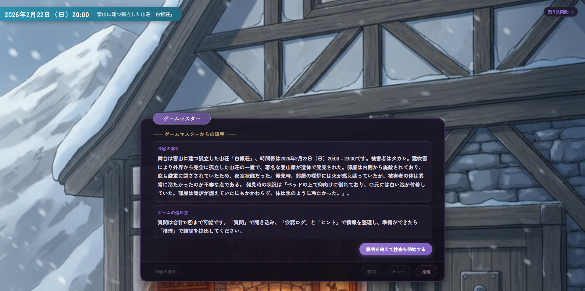

> 一番下に日本語版もあります

# 🔍 Locked-Room Mystery


> **An AI-powered detective game where Gemini acts as your Game Master**

## 🖥️ UI Preview

<p align="center">
  
</p>

## 🎬 Demo Video

Click the thumbnail to open the video on YouTube.

| [](https://youtu.be/OwgDX0RYm6Y) |
| --- |
| Demo Video |

## 🎮 What is this?

This is an **interactive mystery-solving game** where an AI (Google Gemini) plays the role of Game Master (GM). Each playthrough generates a unique locked-room murder case with any setting. Question witnesses, gather evidence, and deduce the culprit before your questions run out!

### ✨ Key Features

| Feature | Description |
|---------|-------------|
| 🎲 **Dynamic Case Generation** | Every game creates a new mystery with unique characters, motives, and tricks |
| 🗣️ **AI Game Master** | Ask any question - the AI responds consistently based on the hidden case data |
| 🤥 **Lying NPC** | One character always lies - spot the inconsistencies! |
| ⏱️ **Limited Questions** | Solve the case within 12 questions |
| 📊 **Detailed Scoring** | Get graded (S/A/B/C) with feedback on your deduction's weaknesses |
| 🌐 **Bilingual** | Play in English or Japanese |

## 🚀 Quick Start

### Using Docker (Recommended)

```bash
docker compose up --build
```

- **Frontend**: http://localhost:5173
- **Backend**: http://localhost:8000
- **Stop**: `Ctrl + C` or `docker compose down`

### Manual Setup

<details>
<summary>Click to expand</summary>

**Backend:**
```bash
cd backend
python3 -m venv .venv
source .venv/bin/activate
pip install -r requirements.txt
uvicorn app.main:app --reload --port 8000
```

**Frontend:**
```bash
cd frontend
npm install
npm run dev
```

</details>

## ⚙️ Configuration

### Environment Variables

| Variable | Default | Description |
|----------|---------|-------------|
| `LLM_PROVIDER` | `fake` | `fake` (offline demo) or `gemini` (real AI) |
| `GEMINI_API_KEY` | - | Required when using Gemini |
| `GEMINI_MODEL` | `gemini-2.5-flash` | Gemini model to use |
| `GEMINI_IMAGE_MODEL` | `gemini-2.5-flash-image` | Gemini model used for story background generation |
| `MAX_QUESTIONS` | `12` | Questions allowed per game |
| `DATABASE_URL` | `sqlite:///./mystery_game.db` | Database connection |

<details>
<summary>All environment variables</summary>

| Variable | Default | Description |
|----------|---------|-------------|
| `LLM_PROVIDER` | `fake` | `fake` or `gemini` |
| `GEMINI_API_KEY` | - | Required for Gemini |
| `GEMINI_MODEL` | `gemini-2.5-flash` | Model name |
| `GEMINI_IMAGE_MODEL` | `gemini-2.5-flash-image` | Background image model name |
| `GEMINI_BACKGROUND_ASPECT_RATIO` | `9:16` | Background image aspect ratio |
| `GEMINI_API_VERSION` | `v1beta` | API version |
| `GEMINI_THINKING_BUDGET` | `0` | `0` disables thinking for lowest latency |
| `GEMINI_THINKING_LEVEL` | - | Legacy fallback (`minimal\|low\|medium\|high`) when budget is unset |
| `GEMINI_RETRY_DELAY_SEC` | `0.8` | Initial retry delay |
| `GEMINI_RETRY_MAX_DELAY_SEC` | `20` | Max retry delay |
| `GEMINI_MAX_ATTEMPTS` | `5` | Max attempts per request |
| `GEMINI_FALLBACK_TO_FAKE` | `false` | Fallback to fake on failure |
| `GENERATED_BACKGROUND_DIR` | `./generated_backgrounds` | Directory to store generated story backgrounds |
| `DATABASE_URL` | `sqlite:///./mystery_game.db` | Database URL |
| `MAX_QUESTIONS` | `12` | Questions per game |
| `VITE_API_BASE_URL` | `http://localhost:8000` | API URL for frontend |

</details>

## 🏗️ Project Structure

```
.
├── backend/
│   ├── app/          # FastAPI application
│   └── tests/        # API tests
├── frontend/
│   └── src/          # React application
└── docker-compose.yml
```

## 🧪 Running Tests

```bash
cd backend
pytest -q
```

## 📖 How to Play

1. **Start a new case** - Click "Generate New Case" on the title screen
2. **Read the intro** - Learn about the crime scene and victim
3. **Ask questions** - Interrogate witnesses and examine evidence (12 questions max)
4. **Watch for lies** - One NPC always lies, but evidence can expose them
5. **Submit your deduction** - Name the killer, motive, method, and trick
6. **Get your score** - See how close you were and learn the truth!

---

<details>
<summary>🇯🇵 日本語版 README</summary>

# 🔍 密室ミステリー

> **AIがゲームマスターを務める即興推理ゲーム**

## 🖥️ UI プレビュー

<p align="center">
  
</p>

## 🎬 デモ動画

サムネイルをクリックするとYouTubeで動画が開きます。

| [](https://youtu.be/OwgDX0RYm6Y) |
| --- |
| デモ動画 |

## 🎮 これは何？

**Google Gemini** がゲームマスター（GM）となり、あらゆる舞台設定の密室殺人事件を即興で進行する **インタラクティブ推理ゲーム** です。プレイするたびに新しい事件が生成され、証人への質問、証拠の収集、推理の提出を通じて犯人を当てます。

### ✨ 主な機能

| 機能 | 説明 |
|------|------|
| 🎲 **動的事件生成** | 毎回新しい事件・人物・動機・トリックが生成される |
| 🗣️ **AI ゲームマスター** | どんな質問にも事件データに基づいて一貫した回答 |
| 🤥 **嘘つきNPC** | 1人は必ず嘘をつく - 矛盾を見抜け！ |
| ⏱️ **質問回数制限** | 12回の質問で事件を解決せよ |
| 📊 **詳細な採点** | S/A/B/Cのランクと推理の弱点トップ3 |
| 🌐 **日英対応** | 日本語・英語の切り替え可能 |

## 🚀 クイックスタート

### Docker を使う（推奨）

```bash
docker compose up --build
```

- **フロントエンド**: http://localhost:5173
- **バックエンド**: http://localhost:8000
- **停止**: `Ctrl + C` または `docker compose down`

### 手動セットアップ

<details>
<summary>クリックで展開</summary>

**バックエンド:**
```bash
cd backend
python3 -m venv .venv
source .venv/bin/activate
pip install -r requirements.txt
uvicorn app.main:app --reload --port 8000
```

**フロントエンド:**
```bash
cd frontend
npm install
npm run dev
```

</details>

## ⚙️ 設定

### 環境変数

| 変数 | デフォルト | 説明 |
|------|---------|------|
| `LLM_PROVIDER` | `fake` | `fake`（オフラインデモ）または `gemini`（本番AI） |
| `GEMINI_API_KEY` | - | Gemini使用時に必須 |
| `GEMINI_MODEL` | `gemini-2.5-flash` | 使用するGeminiモデル |
| `GEMINI_IMAGE_MODEL` | `gemini-2.5-flash-image` | 背景生成に使うGeminiモデル |
| `MAX_QUESTIONS` | `12` | ゲームあたりの質問回数 |
| `DATABASE_URL` | `sqlite:///./mystery_game.db` | データベース接続先 |

<details>
<summary>全環境変数一覧</summary>

| 変数 | デフォルト | 説明 |
|------|---------|------|
| `LLM_PROVIDER` | `fake` | `fake` または `gemini` |
| `GEMINI_API_KEY` | - | Gemini使用時に必須 |
| `GEMINI_MODEL` | `gemini-2.5-flash` | モデル名 |
| `GEMINI_IMAGE_MODEL` | `gemini-2.5-flash-image` | 背景画像生成モデル名 |
| `GEMINI_BACKGROUND_ASPECT_RATIO` | `9:16` | 背景画像のアスペクト比 |
| `GEMINI_API_VERSION` | `v1beta` | APIバージョン |
| `GEMINI_THINKING_BUDGET` | `0` | `0`で思考を無効化し、最小レイテンシ |
| `GEMINI_THINKING_LEVEL` | - | 旧設定（`minimal\|low\|medium\|high`）。budget未指定時のみ使用 |
| `GEMINI_RETRY_DELAY_SEC` | `0.8` | リトライ初期待機秒 |
| `GEMINI_RETRY_MAX_DELAY_SEC` | `20` | リトライ最大待機秒 |
| `GEMINI_MAX_ATTEMPTS` | `5` | 1リクエストの最大試行回数 |
| `GEMINI_FALLBACK_TO_FAKE` | `false` | 失敗時にfakeへフォールバック |
| `GENERATED_BACKGROUND_DIR` | `./generated_backgrounds` | 生成背景画像の保存先ディレクトリ |
| `DATABASE_URL` | `sqlite:///./mystery_game.db` | データベースURL |
| `MAX_QUESTIONS` | `12` | ゲームあたりの質問回数 |
| `VITE_API_BASE_URL` | `http://localhost:8000` | フロントエンド用API URL |

</details>

## 🏗️ プロジェクト構成

```
.
├── backend/
│   ├── app/          # FastAPI アプリケーション
│   └── tests/        # APIテスト
├── frontend/
│   └── src/          # React アプリケーション
└── docker-compose.yml
```

## 🧪 テスト実行

```bash
cd backend
pytest -q
```

## 📖 遊び方

1. **新しい事件を生成** - タイトル画面で「新しい事件を生成」をクリック
2. **導入を読む** - 事件現場と被害者について把握
3. **質問する** - 証人に聞き込み、証拠を調べる（最大12回）
4. **嘘を見抜く** - 1人は必ず嘘をつく、証拠で暴け！
5. **推理を提出** - 犯人・動機・手口・トリックを回答
6. **採点を確認** - 正解との比較と真相を確認！

## 📝 補足

- PostgreSQLにも対応（`DATABASE_URL`を変更するだけ）
- オフラインデモ用に`fake`プロバイダを同梱

</details>
